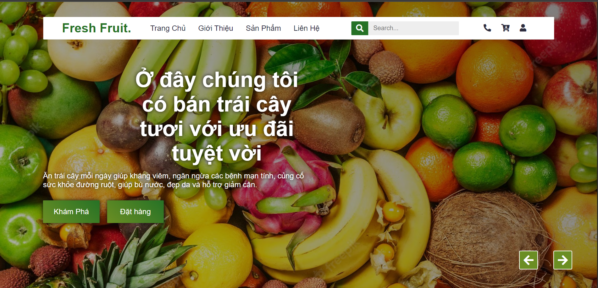
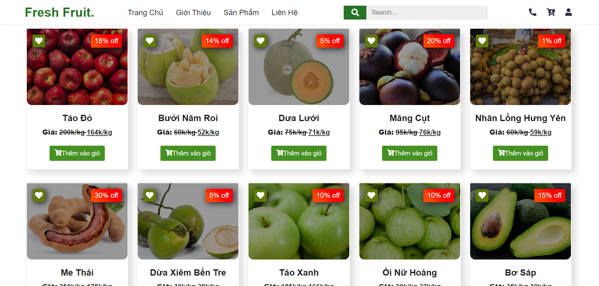

# 🍊 Website Bán Trái Cây – BanTraiCay

Đây là một giao diện website bán trái cây đơn giản, được thiết kế bằng **HTML5**, **CSS3**, và thư viện **Bootstrap**, nhằm mô phỏng một cửa hàng trái cây trực tuyến với giao diện hiện đại và bố cục rõ ràng.

---

## 📄 Giới thiệu

Website bao gồm các trang chức năng cơ bản như:

- 🏠 Trang chủ (`trangchu.html`)
- 🍍 Trang sản phẩm (`sanpham.html`)
- ℹ️ Trang giới thiệu (`gioithieu.html`)
- ✉️ Trang liên hệ (`contact.html`)
- 🔐 Trang đăng nhập (`login.html`)

Phù hợp để làm demo hoặc mở rộng thành một hệ thống thương mại điện tử thực tế.

---

## 🖼️ Giao diện

> Giao diện sử dụng theme trái cây tươi mát, kết hợp màu sắc hài hòa với bố cục hiện đại, responsive.





---

📁 Cấu trúc thư mục
```bash
BanTraiCay-master/
├── trangchu.html             # Trang chủ
├── sanpham.html              # Trang sản phẩm
├── gioithieu.html            # Trang giới thiệu
├── contact.html              # Trang liên hệ
├── login.html                # Trang đăng nhập
│
├── css/                      # Thư mục chứa các file CSS
│   ├── style.css
│   ├── responsive.css
│   └── bootstrap.min.css
│
├── fonts/                    # Font icon (Font Awesome, Linearicons)
└── images/                   # Ảnh minh họa (nếu có)
```
---

🚀 Cách sử dụng
-  Mở trực tiếp file trangchu.html trong trình duyệt để xem giao diện website.
```bash
# Cách mở (trên máy tính)
1. Tải về repo
2. Giải nén (nếu là file .zip)
3. Mở file: BanTraiCay-master/trangchu.html bằng trình duyệt bất kỳ
```
---

💡 Gợi ý mở rộng

-  Tích hợp JavaScript cho các hiệu ứng động (carousel, modal, validate form).

-  Tích hợp backend (PHP/MySQL hoặc Node.js) để xử lý đặt hàng, đăng ký, đăng nhập.

-  Thêm giỏ hàng, thanh toán, đánh giá sản phẩm.

---

👨‍💻 Tác giả
-  Họ tên: Lê Phước Thái

-  Mục đích: Dự án demo website tĩnh môn học/luyện tập giao diện

-  🔗 GitHub: github.com/LePhuocThai2502 
---

📜 Giấy phép

-  Dự án mang mục đích học tập, có thể sử dụng, chỉnh sửa và chia sẻ tự do.

---


